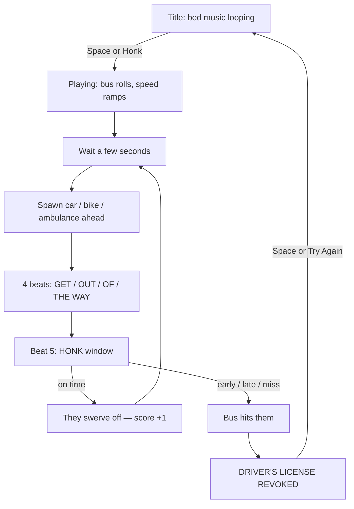

# Out of the Way — project overview

Unity 6 (URP) bus-driver rhythm game. Open `Assets/Scenes/SampleScene`. Designer street meshes live in `Assets/Art` and are assigned on the **OutOfWay** object so they show in the Scene view. Play still recycles those same FBX tiles as you drive.

---

## Folder structure

```
OutOfWay/
├── Assets/
│   ├── Scenes/SampleScene.unity     The game scene (camera, light, volume, OutOfWay).
│   ├── Art/                         Designer FBX: Street, Buildings, StreetAndBuildings
│   ├── Scripts/
│   │   ├── Core/                    Game start, state, music clock
│   │   ├── Gameplay/                Bus, obstacles, honk rhythm
│   │   ├── World/                   City loop using the FBX kit
│   │   ├── Audio/                   Placeholder SFX (horn, crash, engine)
│   │   └── UI/                      Title, HUD, fail screen
│   ├── Resources/
│   │   └── Audio/BackgroundBed.mp3  Looping bed (base tempo)
│   ├── Settings/                    URP renderer / volume profiles
│   └── TutorialInfo/                Unity template readme (ignore)
├── Packages/                        Unity packages (Input System, URP, …)
└── ProjectSettings/                 Unity version 6000.6.0f1
```

`Library/`, `Temp/`, `Logs/` are generated. Do not commit them.

---

## Scripts — what each file does

### Core

| File | Role |
|---|---|
| `GameBootstrap.cs` | Entry point. Builds city, bus, camera, audio, UI, then wires `GameManager`. Inspector: BPM, metronome, future vocal clip. |
| `GameManager.cs` | **Main game loop.** States: Title → Playing → Failed. Honk input, score, crash, retry. |
| `MusicConductor.cs` | Beat clock + looping bed. Loads `Resources/Audio/BackgroundBed`. BPM is derived from an 8-bar (32-beat) loop (~148). |

### Gameplay

| File | Role |
|---|---|
| `BusController.cs` | Bus rolls forward on its own and speeds up. Camera follow. Crash stop. |
| `RhythmDirector.cs` | **Main rhythm loop.** Call-and-response phrase player with tolerance window. |
| `PhrasePattern.cs` | ScriptableObject defining word timings, tolerances, and clips. |
| `PhraseLibrary.cs` | Pattern pool (Even, Rush, Drag, Stutter, Hold, Swing) with fallback defaults. |
| `ObstacleSpawner.cs` | Spawns a car / bike / ambulance far enough ahead for the phrase duration. |
| `ObstacleController.cs` | On success the blocker swerves off the road. Ambulance siren blink. |

### World

| File | Role |
|---|---|
| `EndlessCity.cs` | Recycles the designer FBX street in front of the bus. No generated landscape. |
| `CityKit.cs` | Instances `StreetAndBuildings` / `Street` / `Buildings` and mirrors buildings onto the empty sidewalk. |
| `VehicleFactory.cs` | Player bus from `SM_Bus` when assigned; cars / bikes / ambulance are still primitives. |
| `Look.cs` | URP materials for the bus fallback, obstacles, and imported FBX colors. |

### Audio / UI

| File | Role |
|---|---|
| `ProceduralAudio.cs` | Placeholder horn, clicks, crash, engine rumble until real SFX land. |
| `GameUI.cs` | Title, score/speed chips, beat pips, round HONK button, license-revoked card. |

### Assets

| File | Role |
|---|---|
| `Resources/Audio/BackgroundBed.mp3` | Placeholder loop until other tempos land. |
| `Art/Street.fbx` | Designer road + sidewalks. |
| `Art/Buildings.fbx` | Designer building row (one sidewalk in Maya). |
| `Art/StreetAndBuildings.fbx` | Combined street block used as the looping tile. |
| `Art/SM_Bus.fbx` | Player bus. |

---

## Main loop

Two loops run at once: the **run** (drive / crash) and the **phrase** (chant / honk).



### Run loop (`GameManager`)

1. **Title** — city is visible, bed music playing, bus parked.
2. **Playing** — bus moves along +Z, city tiles recycle behind the camera, obstacles spawn.
3. **Failed** — bus stops, music ducks, license card. Retry reloads the scene.

### Phrase loop (`RhythmDirector` + `ObstacleSpawner`)

Only one obstacle at a time.

1. Spawner picks a phrase pattern and places a blocker far enough for the total chant + response time.
2. **Call:** Words light up across the screen to the rhythm ("Get Out Of The Way").
3. **Response:** Text turns mustard ("HONK IT BACK"). Player echoes the rhythm with honks.
4. **Hit on time:** Each word turns green as accepted. All hit -> obstacle swerves off, streak increases.
5. **Too early, late, or silent:** Text stamps red "FAIL!", bus crashes -> license revoked.

Honk with no active phrase just plays the horn. Does not fail the run.

---

## Where to plug work in

**Music**

- Bed track: replace `Assets/Resources/Audio/BackgroundBed.mp3` (keep the name, or change `MusicConductor.BedResource`).
- New tempos: drop another clip and set `Bpm` on the `OutOfWay` object (or keep auto-BPM from an 8-bar loop).
- Vocal “GET OUT OF THE WAY”: assign `Get Out Of The Way Phrase` on `OutOfWay`. Clip should last **exactly 4 beats**. Uncheck `Metronome Clicks` (already off when the bed is present).

**Art**

- Street tiles: `Assets/Art/*.fbx`, assigned on the `OutOfWay` object in SampleScene.
- Landscape is those meshes only (plus a mirrored `Buildings` row). No cube grass, lamps, or props.

**Feel / timing**

- Bus speed: `BusController` (`StartSpeed`, `MaxSpeed`, `Acceleration`).
- Honk tightness: `RhythmDirector` hit window (`0.42` of a beat).
- Spawn gap: `ObstacleSpawner` (`FirstDelay`, `MinGap`, `MaxGap`).
