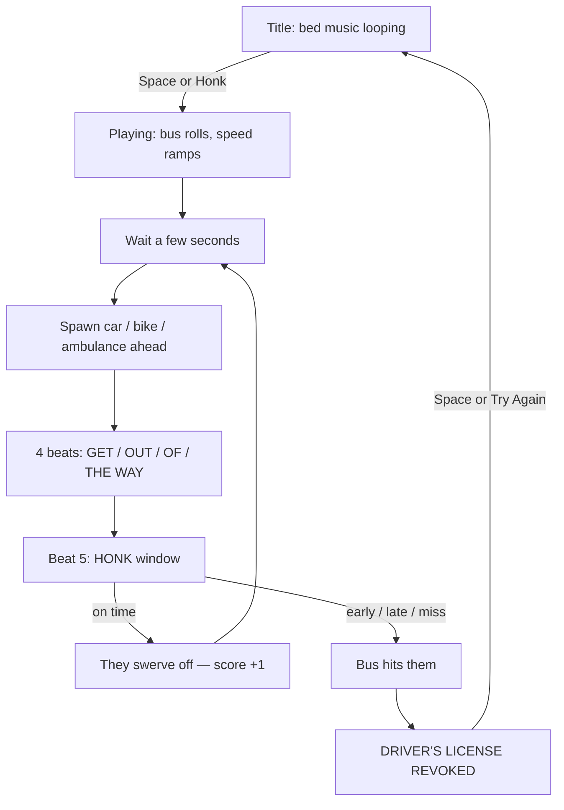

# Out of the Way — project overview

Unity 6 (URP) bus-driver rhythm game. Press Play on `Assets/Scenes/SampleScene`. The world, bus, UI, and music all spawn at runtime from `GameBootstrap` on the `OutOfWay` scene object.

---

## Folder structure

```
OutOfWay/
├── Assets/
│   ├── Scenes/SampleScene.unity     Play this. Contains camera, light, volume, OutOfWay bootstrap.
│   ├── Scripts/
│   │   ├── Core/                    Game start, state, music clock
│   │   ├── Gameplay/                Bus, obstacles, honk rhythm
│   │   ├── World/                   City, vehicles, designer FBX kit
│   │   ├── Audio/                   Placeholder SFX (horn, crash, engine)
│   │   └── UI/                      Title, HUD, fail screen
│   ├── Resources/
│   │   ├── Audio/BackgroundBed.mp3  Looping bed (base tempo)
│   │   └── Art/                     Designer Maya FBX (street + buildings)
│   ├── Settings/                    URP renderer / volume profiles
│   └── TutorialInfo/                Unity template readme (ignore)
├── Packages/                        Unity packages (Input System, URP, …)
└── ProjectSettings/                 Unity version 6000.6.0f1
```

`Library/`, `Temp/`, `Logs/` are generated. Do not commit them.

---

## Scripts — what each file does

### Core

| File | Role |
|---|---|
| `GameBootstrap.cs` | Entry point. Builds city, bus, camera, audio, UI, then wires `GameManager`. Inspector: BPM, metronome, future vocal clip. |
| `GameManager.cs` | **Main game loop.** States: Title → Playing → Failed. Honk input, score, crash, retry. |
| `MusicConductor.cs` | Beat clock + looping bed. Loads `Resources/Audio/BackgroundBed`. BPM is derived from an 8-bar (32-beat) loop (~148). |

### Gameplay

| File | Role |
|---|---|
| `BusController.cs` | Bus rolls forward on its own and speeds up. Camera follow. Crash stop. |
| `RhythmDirector.cs` | **Main rhythm loop.** 4 cue beats (GET / OUT / OF / THE WAY) then a honk window on beat 5. |
| `ObstacleSpawner.cs` | Spawns a car / bike / ambulance far enough ahead for those 5 beats. |
| `ObstacleController.cs` | On success the blocker swerves off the road. Ambulance siren blink. |

### World

| File | Role |
|---|---|
| `EndlessCity.cs` | Recycles street tiles in front of the bus. Uses designer FBX when imported, otherwise cubes. |
| `CityKit.cs` | Loads `StreetAndBuildings` / `Buildings` / `Street`, scales the road to the bus, mirrors buildings onto both sidewalks. |
| `VehicleFactory.cs` | Builds bus, cars, bikes, ambulance from primitives. |
| `Look.cs` | Colors, generated textures, materials, mesh helpers (`Build.Box` etc.). |

### Audio / UI

| File | Role |
|---|---|
| `ProceduralAudio.cs` | Placeholder horn, clicks, crash, engine rumble until real SFX land. |
| `GameUI.cs` | Title, score/speed chips, beat pips, round HONK button, license-revoked card. |

### Assets in Resources

| File | Role |
|---|---|
| `Audio/BackgroundBed.mp3` | Placeholder loop. Base speed for the game until the music person delivers other tempos. |
| `Art/Street.fbx` | Road + sidewalks. |
| `Art/Buildings.fbx` | Building row (one sidewalk in Maya). |
| `Art/StreetAndBuildings.fbx` | Combined street block used as the looping tile. |

---

## Main loop

Two loops run at once: the **run** (drive / crash) and the **phrase** (chant / honk).



### Run loop (`GameManager`)

1. **Title** — city is visible, bed music playing, bus parked.
2. **Playing** — bus moves along +Z, city tiles recycle behind the camera, obstacles spawn.
3. **Failed** — bus stops, music ducks, license card. Retry reloads the scene.

### Phrase loop (`RhythmDirector` + `ObstacleSpawner`)

Only one obstacle at a time.

1. Spawner places a blocker far enough that the bus will reach it in **5 beats**.
2. Beats 1–4: on-screen words **GET / OUT / OF / THE WAY** (this is where the vocal will go).
3. Beat 5: honk window. Space, click, gamepad A, or the HONK button.
4. **Hit the window** → obstacle dodges, score goes up, next spawn after a short gap.
5. **Too early, late, or silent** → crash → license revoked.

Honk with no active phrase just plays the horn. Does not fail the run.

---

## Where to plug work in

**Music**

- Bed track: replace `Assets/Resources/Audio/BackgroundBed.mp3` (keep the name, or change `MusicConductor.BedResource`).
- New tempos: drop another clip and set `Bpm` on the `OutOfWay` object (or keep auto-BPM from an 8-bar loop).
- Vocal “GET OUT OF THE WAY”: assign `Get Out Of The Way Phrase` on `OutOfWay`. Clip should last **exactly 4 beats**. Uncheck `Metronome Clicks` (already off when the bed is present).

**Art**

- Street tiles: `Assets/Resources/Art/*.fbx`. `CityKit` scales the road to the bus and mirrors buildings.
- New meshes: put them in `Resources/Art` and point `CityKit` at the new resource names.

**Feel / timing**

- Bus speed: `BusController` (`StartSpeed`, `MaxSpeed`, `Acceleration`).
- Honk tightness: `RhythmDirector` hit window (`0.42` of a beat).
- Spawn gap: `ObstacleSpawner` (`FirstDelay`, `MinGap`, `MaxGap`).
