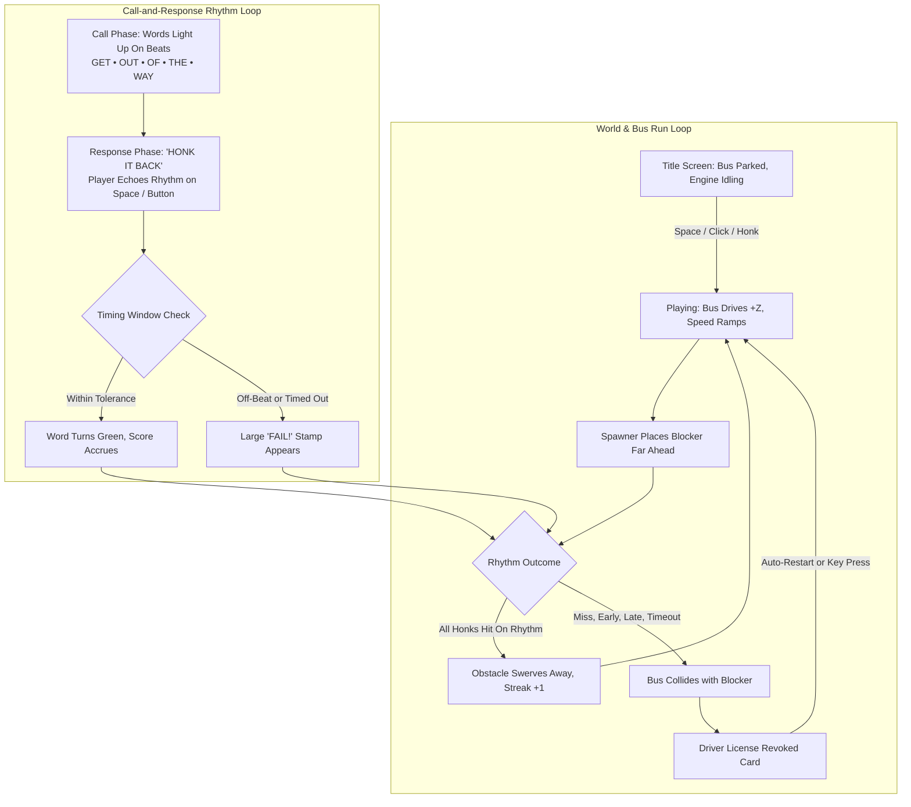

# Out of the Way — Project Overview

**Out of the Way** is a Unity 6 (URP) bus-driver rhythm game built around call-and-response timing. The player drives a city bus along +Z, encountering roadway obstacles. Each encounter triggers a vocal/rhythmic chant ("*Get Out Of The Way*"), after which the player must honk back the exact rhythm to clear the lane.

Open `Assets/Scenes/SampleScene` in Unity. Designer 3D street models live in `Assets/Art/` and are assigned on the **OutOfWay** root GameObject.

---

## Folder Structure

```
OutOfWay/
├── Assets/
│   ├── Scenes/
│   │   └── SampleScene.unity        Game scene (Main Camera, Directional Light, OutOfWay root)
│   ├── Art/                         Designer FBX assets (tracked directly in Git)
│   │   ├── FullScene.fbx            Complete city block (dual building rows, sidewalks, street lamp, road)
│   │   ├── StreetAndBuildings.fbx   Combined block used as default looping tile
│   │   ├── StreetAndSides.fbx       Road surface with concrete sidewalks and curbs
│   │   ├── Street.fbx               Roadway model
│   │   ├── Buildings.fbx            Urban building facade rows
│   │   ├── StreetLamp.fbx           3D street lamp post with neck and lantern
│   │   └── SM_Bus.fbx               Player bus (modular body, wheels, wheel wells)
│   ├── Scripts/
│   │   ├── Core/                    Bootstrap, game state manager, music conductor
│   │   ├── Rhythm/                  Phrase patterns, phrase presets, data models
│   │   ├── Gameplay/                Bus physics, obstacle spawner, obstacle controller, rhythm director
│   │   ├── World/                   Endless city tile looper, CityKit aligner, Look materials, VehicleFactory
│   │   ├── Audio/                   Synthesized engine audio, horn, crash SFX
│   │   └── UI/                      Custom font renderer, call-and-response text animator, HUD
│   ├── Resources/
│   │   ├── Fonts/                   Display fonts (BrownieStencil, ArchivoBlack, Anton, Bangers, Bungee)
│   │   └── Audio/
│   │       └── BackgroundBed.mp3    Looping background rhythm track
│   ├── Licenses/                    Font and asset usage terms (BrownieStencil)
│   ├── Settings/                    URP renderer assets, Universal RP configuration
│   └── TutorialInfo/                Unity template files
├── Packages/                        Unity packages (URP, Input System, Mathematics, etc.)
└── ProjectSettings/                 Project configuration (Unity 6000.6.0f1)
```

> **Note on Version Control:** All `.fbx`, `.ttf`, `.mp3`, and `.png` assets are tracked **directly in Git** (not Git LFS). Any team member can clone or pull with standard `git pull` without needing Git LFS installed or encountering un-imported 130-byte pointer files.

---

## Scripts & System Architecture

### Core

| Script | Purpose |
|---|---|
| `GameBootstrap.cs` | **Runtime Entry Point.** Initializes `Look`, styles the environment, binds designer FBX assets (`CityKit`), instantiates the bus (`VehicleFactory`), configures the camera rig, builds `MusicConductor`, `RhythmDirector`, `ObstacleSpawner`, `GameUI`, and wires `GameManager`. |
| `GameManager.cs` | **State & Session Flow.** Handles `Title` &rarr; `Playing` &rarr; `Failed` transitions. Tracks score, speed, distance, consecutive streaks (*"X IN A ROW"*), and tempo progression milestones (130 &rarr; 140 &rarr; 150 BPM). Implements fast in-place restarts after crashes. |
| `MusicConductor.cs` | **High-Precision Multi-Tempo Audio Engine.** Manages 3 progression tiers (130 BPM, 140 BPM, 150 BPM) with synchronized looping background music and accessibility metronome tracks (`Metro_130`, `Metro_140`, `Metro_150`). Maintains drift-free phase alignment and handles accessibility toggling. |

### Rhythm & Call-and-Response

| Script | Purpose |
|---|---|
| `RhythmDirector.cs` | **Rhythm Loop & Judgment.** Orchestrates the call-and-response cycle. Plays the vocal/visual cue sequence on the "Call" phase, listens for player honks during the "Response" phase, evaluates rhythmic accuracy against pattern timing windows, and fires hit/fail callbacks. |
| `PhrasePattern.cs` | **Pattern Definition.** Defines token sequences (`"Get"`, `"Out"`, `"Of"`, `"The"`, `"Way"`), exact beat timings (`WordTimes`), tolerance windows (`Tolerance`, `PerfectTolerance`), and response timeouts. |
| `PhraseLibrary.cs` | **Rhythm Preset Pool.** Supplies phrase pattern variations: `Even` (straight quarter beats), `Rush` (accelerating rhythm), `Drag` (swung delay), `Stutter` (syncopated double hits), `Hold` (dramatic pause), and `Swing`. |

### Gameplay

| Script | Purpose |
|---|---|
| `BusController.cs` | Auto-drives forward on +Z with continuous acceleration. Manages lane-switch steering tilt, crash spinouts, rest alignment, and wheel rotation. |
| `ObstacleSpawner.cs` | Dynamically calculates obstacle spawn distances ahead based on current bus speed and the active phrase's duration (`ResponseTimeout`). Spawns cars, bicycles, or ambulances into the bus's lane. |
| `ObstacleController.cs` | Controls obstacle behavior. On rhythmic success, smoothly steers the vehicle off the road. Controls alternating siren flashes on ambulances. |

### World & Rendering

| Script | Purpose |
|---|---|
| `CityKit.cs` | **Designer FBX Placement Engine.** Inspects imported FBX hierarchies to isolate the road mesh (`Street`), automatically calculates scaling to achieve a standard road width (`8.2m`), aligns road surfaces flush to ground level, and tiles blocks seamlessly along +Z. |
| `EndlessCity.cs` | **Infinite City Tile Recycler.** Pools and recycles designer city blocks (`FullScene.fbx` / `StreetAndBuildings.fbx`) ahead of the bus and removes distant tiles behind the camera. Uses 100% designer meshes with no procedural cube filler. |
| `VehicleFactory.cs` | **Vehicle Constructor.** Spawns and configures the designer `SM_Bus.fbx` facing +Z, scales it to 7 units length, sets trigger collision bounds, attaches wheel spinners (`SpinWithSpeed`), and generates stylized obstacle traffic. |
| `Look.cs` | **URP Material & Palette Bridge.** Automatically converts imported FBX materials to URP Unlit/Lit shaders. Maps Maya material slots (`lambert3`, `lambert4`, `lambert5`, `lambert6`, `lambert7`, `M_Bus_01`, `M_Wheel_01`, `M_WheelClinder_01`) and object-name fallbacks to cohesive game colors while preventing untextured grey meshes. |

### UI & Audio

| Script | Purpose |
|---|---|
| `GameUI.cs` | **Dynamic Typography & Accessibility UI.** Renders using `BrownieStencil` (fallback to `ArchivoBlack`). Features hand-stamped tilted HUD stats (`_score`, `_streak`, `_speed`), recentered title bar, animated word tokens that light up on the Call (`Dim` &rarr; `Paper`), flips to **"HONK IT BACK"** (`Mustard`), turns words **Green** on rhythmic hit (`ShowHonkAccepted`), stamps red **"FAIL!"** on mistake, announces tempo upgrades (**"SPEED UP! 140 BPM"**), punches streak counters, and provides Metronome Accessibility toggle buttons on Title and HUD (default OFF, toggle via click or `[M]`). |
| `ProceduralAudio.cs` | Synthesizes placeholder horns, crash noise, metronome clicks, and pitch-scaled engine rumbling. |

---

## Game Loop

Two synchronized loops run simultaneously:



### Call-and-Response Breakdown
1. **Obstacle Spawns**: A blocker appears down the road at a distance calculated from `Speed * PatternDuration`.
2. **Call Phase**: Words light up across the screen in sync with the beat (*GET &rarr; OUT &rarr; OF &rarr; THE &rarr; WAY*).
3. **Response Phase**: Prompt flips to **"HONK IT BACK"**. The player taps Space, Left Mouse, or Gamepad A to mirror the phrase rhythm.
4. **Hit Evaluation**: Each honk is judged against `WordTimes` relative to the first response beat. Correct hits turn the corresponding word green.
5. **Outcome**:
   - **Full Phrase Matched**: Blocker dodges into the sidewalk, score increments, streak increases with punch animation, speed increases.
   - **Mistake / Timeout**: Words stamp red "FAIL!", bus impacts the vehicle, and driver's license is revoked.

---

## 3D Art Assets (`Assets/Art/`)

| Asset | Details & Hierarchy |
|---|---|
| `FullScene.fbx` | Complete urban street block: asphalt road (`Street`), concrete sidewalks with curbs (`Sides`), multi-story building rows on both sides (`Buildings_side_1`, `Buildings_side_2`, `Buildings_side_3`), and metal street lamps (`Street_lamp`). |
| `SM_Bus.fbx` | Player bus asset. Composed of `SM_Body_01`, `SM_Front_01`, front and rear wheel meshes (`SM_FrontWheel_01`, `Sm_FrontWheel_02`, `SM_BackWheel_01`, `SM_BackWheel_02`), and wheel wells (`SM_WheelClider_01`). |
| `StreetAndSides.fbx` / `Street.fbx` | Modular roadway and sidewalks without buildings for customizable layouts. |
| `Buildings.fbx` | Dual-sided building row models for urban backdrop variety. |
| `StreetLamp.fbx` | Standalone street lamp model with pole, curved neck, and lamp top/bottom. |

---

## Where to Configure & Customize

- **Music Bed**: Replace `Assets/Resources/Audio/BackgroundBed.mp3` or configure `BackgroundBed` in `GameBootstrap`.
- **Rhythm Patterns**: Create or customize `PhrasePattern` ScriptableObjects in `Assets/Scripts/Rhythm/` and assign them to `Phrases` in `GameBootstrap`.
- **Hit Windows & Difficulty**: Adjust `ToleranceScale` (0.25 to 4.0) on the `OutOfWay` inspector to make timing tighter or more forgiving.
- **Bus Speed & Acceleration**: Tune `StartSpeed`, `MaxSpeed`, and `Acceleration` in `BusController.cs`.
- **Designer 3D Models**: Assign custom FBX prefabs into the inspector fields (`FullScene`, `Buildings`, `Street`, `Bus`, `StreetLamp`) on the `OutOfWay` GameObject in `SampleScene`.
